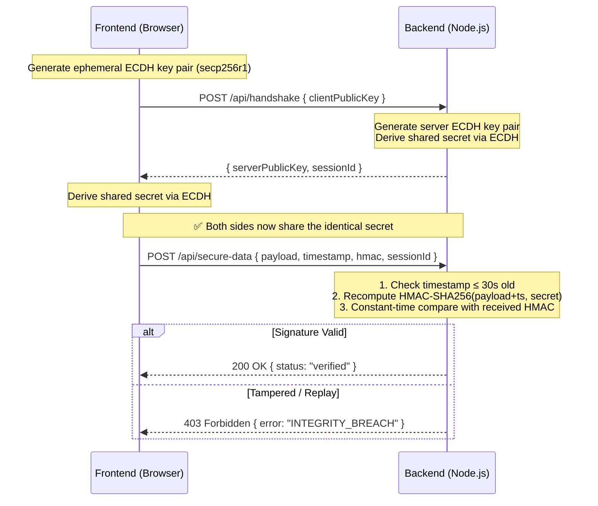

# 🔒 Secure API Communication System

A full-stack, native web prototype demonstrating post-quantum resistant **ECDH Key Exchange** and **HMAC-SHA256 signature verification** to protect against Man-in-the-Middle (MITM) and Replay attacks. 

Built with **Node.js (Native Crypto)** and **Vite (Vanilla JS + Web Crypto API)**, wrapped in a premium "Cyber-Vault" dark-mode aesthetic.

---

## 🎯 Security Features (OWASP A02 Mitigations)

This prototype was built specifically to demonstrate mitigations for **OWASP API Security Top 10 - A02: Cryptographic Failures**:

1. **ECDH Key Exchange (secp256r1):** The client and server generate ephemeral key pairs and derive a shared secret over an insecure channel. The secret itself is *never* transmitted over the wire.
2. **Data Integrity (HMAC-SHA256):** Every API request is signed using the derived shared secret. Any modification to the payload in transit causes the server to reject the request to prevent MITM tampering.
3. **Replay Attack Protection:** A client timestamp is included in the signed payload. The server rejects any request where the time delta exceeds 30 seconds.
4. **Timing Attack Mitigation:** The server uses `crypto.timingSafeEqual()` to safely compare signature buffers.
5. **Zero External Crypto Dependencies:** Relies entirely on native browser features (`window.crypto.subtle`) and Node.js built-ins (`crypto`).

---

## 🖥️ UI & Interactive Elements

The application features a **"Cyber-Vault" Aesthetic** (`#0D1117` background, glassmorphism UI cards, glowing electric blue accents). 

**Interactive Features Include:**
- **Terminal Live Log:** A real-time system log panel displaying cryptographic operations (key generation, secret derivation, payload interception).
- **Public Key & Shared Secret Validation:** Displays truncated public keys and a masked shared secret on the client to visually confirm ECDH key exchange success.
- **The "Attacker" Toggle:** An interactive switch that simulates a Man-in-the-Middle (MITM) attack by maliciously altering the payload *after* the client computes the HMAC signature.
- **Security Dashboard Badges:** Glowing green **SECURE** badges for verified requests, and glitching red **INTEGRITY BREACH** alerts for tampered signatures.

---

## 🏗️ Architecture Flow



---

## 🚀 How to Run Locally

### Requirements
- Node.js (v18+ recommended)

### 1. Start the Backend

Open a terminal and run:

```bash
cd backend
npm install
npm run dev
```

The server will start on `http://localhost:3000`.

### 2. Start the Frontend

Open a second terminal and run:

```bash
cd frontend
npm install
npm run dev
```

The Vite client will be available at `http://localhost:5173`. Open this URL in your browser to interact with the prototype.
